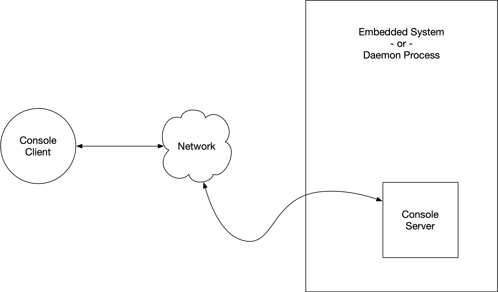
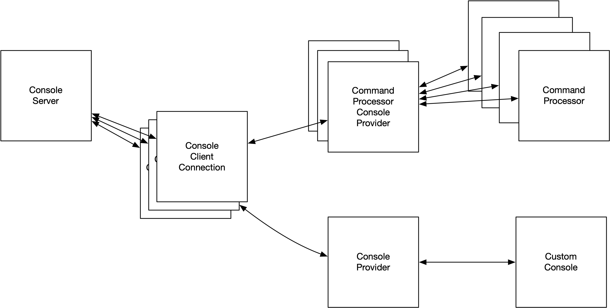

= Console Server
Tom Dilatush (tom@dilatush.com) +
V1.0, 2021-01-03
:toc:
:toc-placement!:
toc::[]

== An Overview...
The basic idea of the console (server and client together) is to provide a way for an embedded system or daemon process to communicate with a developer or tester via something like a command line terminal.  This is analogous to using SSH to connect to a server -- except that instead of connection to the operating system's shell, you're connecting to a simple text-based environment provided by code that you write.

Here's a simple example to illustrate the utility of a console like this.  Suppose you're writing the code for an embedded system that has behavior based on clock time.  While you're developing and testing, it would be very useful to be able to set the real time clock in your system to arbitrary times.  But it's an embedded system -- how are you going to "talk" to it?  That's the kind of problem this console is intended to solve.  In this example, you'd make a console server that had a command available to set the real time clock.  From the connected client, you'd type something like `setclock 12:35:50` to do it.  You might also have a command to give you the current value of the real time clock -- maybe the command `readclock` would send `12:37:44` back to you.  That's the general idea!  The console server places no restrictions on what you might do with it; it just provides the mechanism to let a console client connect with your embedded console server.  The rest is up to you.

The console server implementation gives you two different ways to create your environment; we call those "console providers".  The most basic way is that it simply provides an interface that sends strings typed on the console client to your provider, and lets your provider write strings back to the console client.  On top of this basic interface, we also make available a console provider based on the notion of "command processors".  Any number of command processors can be associated with this provider.  Each processor implements a single command, which has a name that the user can type to use it.  Each processor, when called, has an argument that is a list of the "command line arguments" that appear after the command itself.  You may notice that this is very much like what the `main()` method of a Java program has as its arguments.  This was not accidental :).

The general structure of the console server (and client) is shown below.  The Console Client is a companion application that you can find https://github.com/SlightlyLoony/ConsoleClient[here].  The Console Server is the subject of this document, and it is an instance of the class `ConsoleServer` that runs in its own thread as a component of either an embedded system or a daemon process.  The Console Server listens on a TCP socket for network connections initiated by the Console Client.  Once the connection has been established, all the data is encrypted with a private key, using AES128 in counter mode.  If you're not familiar with that terminology, that means it's encrypted with a modern standard cipher, using a modest-sized key, and the encryption protocol is a solid one.  Authentication is implicit by the possession of the encryption key -- meaning that the Console Server and the Console Client _both_ have to have the private key, or they won't be able to connect.

== Detailed structure of the console server
Here's how all the components of the console server play together:

=== `ConsoleServer`
This is the basis of the entire console server.  Once you instantiate it, it starts listening for console client connections.  When it receives a connection, it creates a thread and starts an instance of `ConsoleClientConnection`.

Constructing `ConsoleServer` requires an instance of `ConsoleServer.Config`, which you can provision in any way that you'd like.  In that configuration you specify the maximum number of clients that can be connected simultaneously (there is a thread for each client, which is the main reason for limiting it), the name of the console server (which is transmitted in the clear to anything making a TCP connection), the key (more on that below), the TCP port the server should listen for client connections on, the IP address of the network interface to listen on (bind to), and a map of the providers (more below).

The key is a 128-bit key encoded in base64, and must be identical on both the server and the client that wants to connect.  If a client doesn't have that key, it can't connect -- so the key is effectively the authentication for the client.  Naturally, this key should NOT be embedded in your code, but rather configured from a file that is stored securely, much as you's store your SSH private keys securely.

Your implementation can have any number of console providers.  Each has a name, and when the console client connects to the console server, it provides the name of the console provider it wants to "talk" with.  The map of console providers is how the console server translates that name to the actual code of the console provider: it maps the name to the fully qualified class name of the provider.  Your console provider must subclass `ConsoleProvider` (or `CommandProcessorConsoleProvider`), and it must have a no-args constructor.

=== `ConsoleClientConnection`
Instances of `ConsoleClientConnection` are created by `ConsoleServer` when a client connects to the console server.  The client connection handles all the details of connecting (see <<Console Server protocol>>), and provides a decrypted input stream for what the user types on the console client, and an encrypting output stream for sending text to the console client.  It also looks up the console provider that the console client asked for, and instantiates and runs that provider.  Note that the console provider runs in the same thread as the console client connection.  Note that the console server can be configured to allow any number of these simultaneously, including just one.  Limiting the number of simultaneous `ConsoleClientConnection`s primarily is a way to save on memory, since (depending on the platform) each thread will likely require several megabytes of RAM for its stack.

=== `ConsoleProvider`
`ConsoleProvider` is an abstract class that must be the base of all console providers.  It is a lightweight "shim" that provides a minimalistic base for you to build custom console providers on top of.  It is also the base class for `CommandProcessorConsoleProvider`, which is arguably an easier way to build custom console providers.  Within a single console server implementation, there may be any number of subclasses of `ConsoleProvider` or `CommandProcessorConsoleProvider`.

=== `CommandProcessorConsoleProvider`
This abstract class provides a more substantial base for console providers to be built upon.  The general idea of it is to provide an environment that represents something more akin to an operating system's shell, and the commands available to it.  The general idea is that you create a console provider by adding one or more "command processors" to implement the commands you actually want.  Two such commands are built into this class, and are automagically included with every subclass of it: "?" for help, and "exit" to quit.  Any other commands are up to you, and are provisioned in your subclass of `CommandProcessorConsoleProvider`.  For example, consider the example of the real time clock that we discussed in <<An Overview...>>.  You would create two `CommandProcessor` subclass instances for this: one named `setclock` that took one argument, and another named `readclock` that had no arguments.  Each of your added command processors includes a description and help, so the built-in help command can generate a list of all the available commands (with their descriptions), or detailed help on any specific command.  For instance, if the user typed `? setclock` on the console client, she'd see the detailed help you provided (you _did_ do that, didn't you?) for that command.

One little convenience feature of this class is worth mentioning: the console client user doesn't necessarily have to type the entire command in each time -- all that's needed is enough of it to be unambiguous.  So, for instance, if `setclock` was the only command that started with `s`, then an `s` is all that would have to be typed.

=== `CommandProcessor`
Each command processor is responsible for implementing a single command.  When `CommandProcessorConsoleProvider` sees that a particular command has been invoked, it finds the right `CommandProcessor` and calls the method below, which of course your command processor must implement:
....
    /**
     * Called when the console client invokes this command.  The given line is the entire
     * command line as the user typed it.  The given list of "words" are the parsed words
     * and quoted strings that appear after the command itself, if any.
     *
     * @param _line  The command line as the user of the console client typed it.
     * @param _words The "words" appearing after the command itself.
     */
    protected abstract void onCommandLine( String _line, List<String> _words );
....
The list of "words" is the list of command line arguments that appear after the command itself, on the line that the user typed on the console client.  The definition of "words" is very similar to that used by command shells, except that commas (",") are also valid separators.  Strings enclosed in double quotes are a single word, even if they contain word separators.  Inside of those double quotes, a double quote or backslash character can be included by escaping them with a backslash.  For instance, if `"this crazy t\"hing"` was on the command line, the word seen in the list of words would be `this crazy t"hing`.

What that command processor does is entirely up to you!

== Console Server protocol
This implementation uses a simple, fixed protocol (described below) that is encrypted with AES with 128 bit keys in CTR mode with a random 128 bit nonce, in continuous streams (separate streams in each direction).  The AES key is a shared secret, manually distributed, and access to it implicitly provides authentication.

The protocol is as follows:

. The client initiates a TCP connection to the server, which is listening on specific, known TCP port.
. The server transmits a fixed identification string (`Loony Console Server`), its version (as major.minor), and its name as comma-separated values followed by a newline, all encoded in UTF-8 and sent as plaintext.  For example, a console server of the first-released version, with a name of "test", would transmit `Loony Console Server,1.0,test\n`.  The only restrictions on the name are that it may not contain either a comma or a newline, for obvious reasons.
. The client receives this string and determines (from the name) whether it has an encryption key for this console server.  If it does not, it closes the TCP connection.
. The client generates a random 128 bit initialization vector and transmits it (in binary) to the server.  All further transmissions from the client to the server are encrypted using this initialization vector and the shared key.
. The client sends a console name, terminated by a newline, to the server.  If the server does not provide a console by this name, it terminates the connection.
. The server generates a random 128 bit initialization vector and transmits it (in binary) to the client.  All further transmissions from the server to the client are encrypted using this initialization vector and the shared key.
. The server sends "OK\n" to the client, as an acknowledgement of successful connection and console selection.  If the client receives anything other than "OK\n", it terminates the connection.

Once the above protocol has been satisfied, there exists an encrypted TCP connection between the console client and the specified console provided by the console server.  These two can exchange data for so long as the connection is maintained.  Either side may end the session at any time by terminating the TCP connection.

== How is this package licensed?
Console is part of the Util package, which is licensed with the quite permissive MIT license:
....
Created: January 19, 2021
Author: Tom Dilatush <tom@dilatush.com>
Github:  https://github.com/SlightlyLoony/Util
License: MIT

Copyright 2021 Tom Dilatush (aka "SlightlyLoony")

Permission is hereby granted, free of charge, to any person obtaining a copy of this software
and associated documentation files (the "Software"), to deal in the Software without restriction,
including without limitation the rights to use, copy, modify, merge, publish, distribute,
sublicense, and/or sell copies of the Software, and to permit persons to whom the Software is
furnished to do so.

The above copyright notice and this permission notice shall be included in all copies or
substantial portions of the Software.

THE SOFTWARE IS PROVIDED "AS IS", WITHOUT WARRANTY OF ANY KIND, EXPRESS OR IMPLIED, INCLUDING
BUT NOT LIMITED TO THE WARRANTIES OF MERCHANTABILITY, FITNESS FOR A PARTICULAR PURPOSE AND
NONINFRINGEMENT. IN NO EVENT SHALL THE AUTHORS OR COPYRIGHT HOLDERS BE LIABLE FOR ANY CLAIM,
DAMAGES OR OTHER LIABILITY, WHETHER IN AN ACTION OF CONTRACT, TORT OR OTHERWISE, ARISING FROM,
OUT OF OR IN CONNECTION WITH THE SOFTWARE OR THE USE OR OTHER DEALINGS IN THE SOFTWARE.
....
