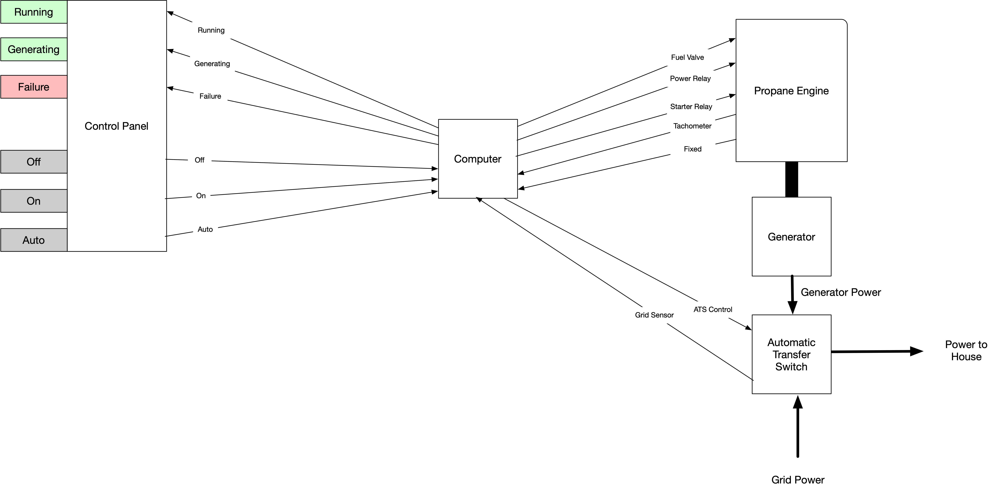
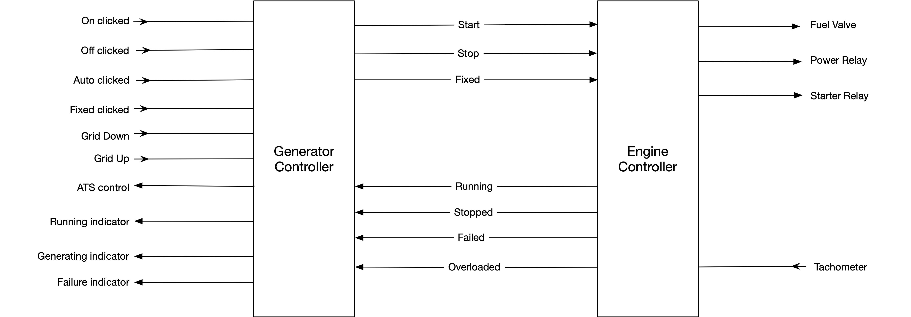
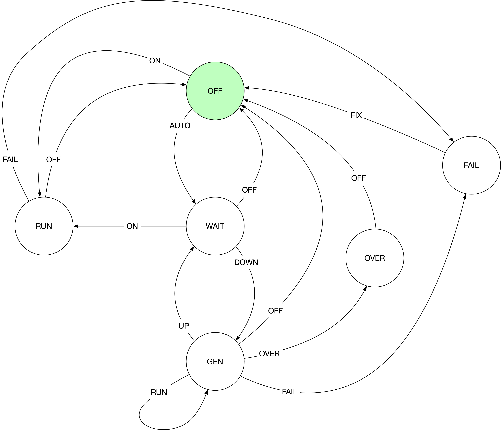
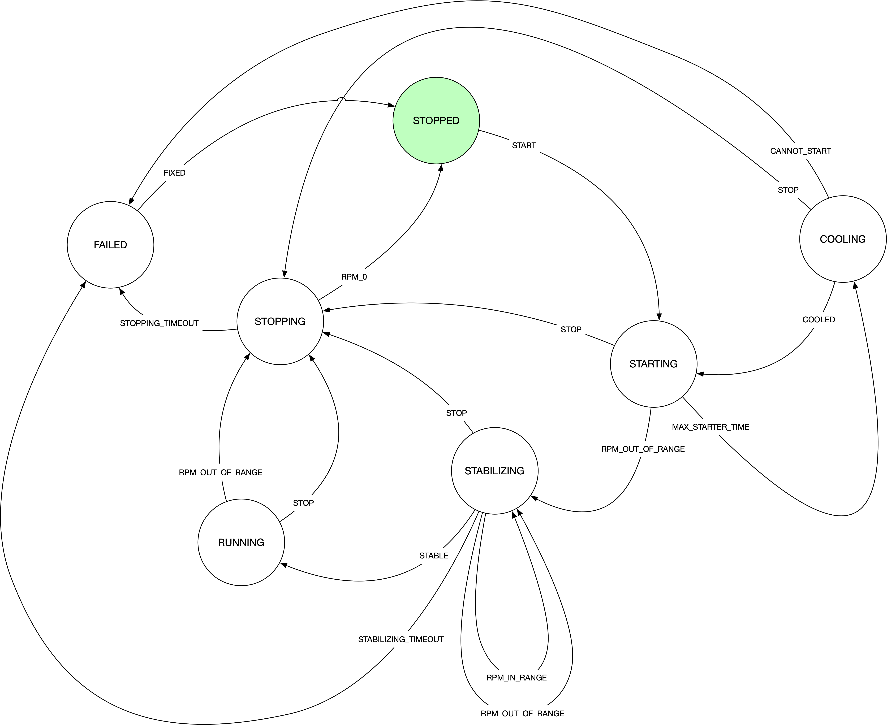

= Finite State Machine
Tom Dilatush (tom@dilatush.com) +
V1.0, 2021-01-03
:toc:
:toc-placement!:
toc::[]

== Why did the author inflict this monstrosity on us?
Rational people can debate whether Finite State Machines (FSMs) are _ever_ a good idea, but this author doesn't associate with such people - rational or not.  There are _many_ situations where an FSM is a great approach to solving a software challenge.  An FSM would never be the _only_ viable solution, but this author believes that (a) there are many scenarios where an FSM is the best choice, and (b) FSMs are often not used, where they really should be, because too many engineers don't understand them and the tools are lacking.  This package is the author's attempt to address the latter two issues - it's far easier to use this package to build an FSM than it is to roll one on your own, and if it's easy enough to build an FSM, well then maybe more engineers will do so!

== What's an example of a situation where an FSM would be a good solution?
Glad you asked!  We're going to present an example in detail, and use that example to explain how this package works.

=== Our example problem: a home backup generator...

Our example's story begins on one fine, sunny morning when you go into work and your boss throws a pile of documentation on your desk and says "Here's a new project for you - write the firmware for this generator!"  She's talking about a new piece of hardware that your company's grease-covered, chain-smoking hardware engineers have built.  It's going to be a new model of backup generator for people who are selfish enough to want electrical power to their home even if the power grid fails.  The generator is based on a propane-fueled engine which is connected to a generator.  The power from the generator goes to an automatic transfer switch (ATS) that can route power to the house either from the power grid or from the generator.  There's a control panel, too, with some indicator lights (for running, generating, and failure) and some push buttons (for off, on, and automatic modes).  In the middle, there's a computer that's connected to all these things - and your job (whether you accept it or not!) is to write the firmware that makes all this stuff play nice together.  On top of the pile of documentation is this block diagram that summarizes the hardware:

Next on the pile of docs is a short description of how all this is supposed to work:

* *Engine*: To run the engine, first you turn on the fuel valve and power relay.  Then you run the starter motor until the engine starts, but not more than 15 seconds or the starter motor will overheat.  If you run the starter for 15 seconds, then you have to wait 15 seconds (for the starter motor to cool down) before you can run it again.  Once running, the engine's governor will make it run at 1800 RPM, +/- 0.5%.  If the engine doesn't reach this speed and keep it there within 30 seconds, there's a problem with the engine.  If too much electricity is drawn from the generator, the engine will overload and the RPM will drop below 1800 - if this happens the engine must be stopped before it is damaged.  To stop the engine, turn off the fuel valve and power.  The engine has a tachometer that reports its RPM to the computer, and a hidden switch that a technician can press to indicate an engine problem has been fixed, but no other feedback.
* *Generator*: There are no controls for the generator, nor feedback from it.  It is connected by a fixed shaft to the engine, so when the engine turns the generator also turns.  While the ATS connects the power grid to the home, there is no load on the generator, and therefore no load on the engine (other than the inertia of changing its rotational rate).  When the ATS connects the generator's output to the house, the load on the generator (and the engine) is directly proportional to the amount of electricity being used.
* *Automatic Transfer Switch*: This has a binary control that either connects the grid power to the house, or the generator's output to the house.  It also has a sensor that reports to the computer when the grid power goes up or down.
* *Control Panel*: This is an ugly little metal panel with three indicator lights that the computer controls, and three push-button switches that the computer can sense:
** _Running Indicator_ Should be lit when the engine is running.
** _Generating Indicator_ Should be lit when the generator is actually supplying electricity to the house.
** _Failure Indicator_ Should be lit when there's an engine failure or generator overload.
** _"On" push-button_ When the user presses this, the engine should be started.  This is used for testing the engine, and should _not_ cause the ATS to switch to using the generator's power.
** _"Off" push-button_ When the user presses this, the generator should be disconnected from the house (if it was connected) and the engine should be stopped.
** _"Auto" push-button_ When the user presses this, the generator should go into "automatic mode", meaning that if the grid power goes down it will automatically start the engine, wait for it to get to a stable 1800 RPM, and then switch the ATS to connect the generator to the house.  When the grid power comes back up, the ATS should switch over to grid power and the engine should be stopped.  The generator should stay in auto mode unless the user presses either the "On" or "Off" push-buttons, or if there's a failure or overload.

The rest of the documentation is just a bunch of technical details about the computer board, how the wiring is connected, and so on.  Those are all very important in the real world, but for the purposes of our example we can ignore all that.

=== Coming up with a general approach to the problem...
On reading the description above, the first thing we note is that there are two very different occasions when the engine may be running: when the user tells it to turn on, and when (in auto mode) the power grid goes down.  We can also note that controlling the engine is reasonably complicated, with some rules that must be carefully followed, some important timing, and so on.  This suggests that part of our software design should be dedicated to controlling the engine, and we'll give that part the creative name of "Engine Controller".

Another thing we can note in the above description is that the control panel and ATS together control the overall behavior of the generator, and that this is actually a simpler problem than controlling the engine.  We'll make another part of our software design to handle this, and call it the "Generator Controller", because we have such a creative mind.

Those two things turn about to be the only components our software design needs, so we turn them into a block diagram showing external events and actions, but ignoring all those pesky internal details:

Almost all the arrows are either _events_ (something that happened), or _actions_ (something to do).  Inputs into the left side of the Generator Controller, at top, are events from the three control panel switches being clicked, the fixed button in the engine being clicked, and then the grid going up or down.  At the bottom left are the ATS actuator output (which controls whether the house is connected to grid power or generator power), and the three indicator lights.  At the top right of the Engine Controller, are the three actuators that control the engine's fuel valve, power relay, and starter relay.  At the bottom right is an input from the engine, the only input that's not an event: the tachometer to measure the engine's RPM.  Between the two controllers, you can see the three events sent from the Generator Controller to the Engine Controller, telling the engine to start, stop, or that it's been fixed.  Similarly, there are four events sent by the Engine Controller to the Generator Controller, to declare that the engine is running at 1800 RPM, stopped, failed, or was overloaded.  If we assume the appropriate logic in the two controllers, then this block diagram shows everything needed to satisfy our project requirements.

Now, about that logic...

=== The Generator Controller
This is the easy one, so we'll tackle it first.  In our block diagram we identified all the events the Generator Controller (GC) could see, and that's one key step toward designing a Finite State Machine (FSM) to implement it.  Here we're going to tackle the next step: how those events should change the _state_ of the FSM.  We'll use a _state diagram_ as a thinking and documentation tool in this process.

First we'll imagine that we've just powered up the generator, and that the engine won't run until the user tells it to.  In other words, the generator is _off_ right after we power it up.  That's our first state: OFF!  It's green on the diagram because it's the _initial state_, which simply means it's the state the FSM is in when it first starts.  Then we think about the events that the GC could get that would change it to another state.  There are only two such events: the user clicking the ON button, and the user clicking the AUTO button.  None of the other events have any effect on the OFF state - the generator just stays off.

So what happens when the user clicks the ON button?  Well, the generator is going to go into "run" mode, where the engine is running (but the generator is not connected to the house) - so we'll make a GC state named RUN.  In the state diagram below, the arrow labeled "ON", running from the bubble labeled "OFF" (which represents the GC's OFF state) to the bubble labeled "RUN" represents that state change.  In FSM-speak, those are called _state transitions_.  An FSM state transition is always triggered by an event that occurs while in a particular state.  There's another thing that has to happen when the user clicks that "ON" button, as we're not just transitioning to another FSM state -- we also have to tell the engine to start.  In FSM-speak, that's an example of an _action_.  The state diagram doesn't show FSM actions, however -- and right at the moment those actions are actually a distracting detail that we're going to ignore.  One thing you should understand, however, is that FSM actions can be associated with a state transition.

Let's talk through one more state definition.  Imagine that the user has clicked the "ON" button, and the GC is now in run mode, and it has told the engine to start.  What events affect the RUN state?  An obvious one is that the user could click the "OFF" button -- we then want to tell the engine to stop and go back to the OFF state.  The engine can't be overloaded in this state, as we're not going to connect the generater to the home -- we're just checking that the engine runs.  However, the engine could tell us that it has failed, in which case the generator shouldn't work again until it is fixed.  That sounds like another GC state: FAIL.  Those are the only ways to _leave_ the RUN state, but are there any other ways to _enter_ it?  Yes, there is -- if the generator is in auto mode, and is waiting (the GC WAIT state!) for the grid to go down, and the user clicks the "ON" button, then the GC should also go into the RUN state (and tell the engine to start).  With that, we've defined all the ways for the GC to get into or out of the RUN state.

If you think about the GC states we've already identified (OFF, RUN, and WAIT) and all the events the GC sees, then you should be able to understand everything on the diagram above, with one possible exception: that weird state transition labeled RUN that goes from the GEN state, turns around, and comes back to the GEN state.  What's up with that?  This is how we show an event that doesn't actually cause the FSM's state to change, but does have an action associated with it.  In this case we want to show that when we're in the GEN state, and the engine gets stable at 1800 RPM (that's what causes the RUN event), then we're going to take an action: connecting the house power to the generator.

The state diagram is a great tool for thinking about and documenting all the states of an FSM, and all the event-triggered transitions between those states.  We identified all the events earlier, and now with this state diagram we have also identified all the states and the state transitions.  These are key steps toward the complete design of an FSM.  The only remaining step is to identify the _actions_ that the FSM needs to take.  In the case of this simple FSM for the GC, all of those actions are associated with state transitions.  In this case (and very commonly) these actions are so simple that we're not going to bother with a design or specification -- we're going to go straight to the code.  You can refer to the source code for the `GeneratorController` class for more details than we'll show here.

First, here's how we tell the FSM about the events and states that we've identified:
....
    /**
     * The FSM states for the Generator Controller's FSM.
     */
    private enum State {
        OFF,    // generator is off; will not back up the grid
        RUN,    // generator engine is running, but will not back up the grid (exercise)
        WAIT,   // generator engine is off, grid has the load, waiting for the grid to go down
        GEN,    // generator engine is running, and has the load
        OVER,   // generator has overloaded, and engine is not running
        FAIL    // generator has failed
    }

    /**
     * The FSM events for the Generator Controller's FSM.
     */
    private enum Event {
        ON,    // user pressed on button
        OFF,   // user pressed off button
        AUTO,  // user pressed auto button
        FIX,   // technician pressed fixed button
        UP,    // grid went up
        DOWN,  // grid went down
        FAIL,  // generator failed
        RUN,   // generator is running
        OVER   // generator overloaded
    }
....
This are just simple Java enums, and they exactly match what we put on the state diagram.  Easy peasy!  Next we're going to _specify_ the FSM for `GeneratorController`, which means creating and configuring an instance of `FSMSpec`:
....
        FSMSpec<State,Event> spec = new FSMSpec<>( State.OFF, Event.OFF );

        spec.addTransition( State.OFF,     Event.ON,     this::onAction,      State.RUN    );
        spec.addTransition( State.OFF,     Event.AUTO,   null,                State.WAIT   );
        spec.addTransition( State.RUN,     Event.OFF,    this::offAction,     State.OFF    );
        spec.addTransition( State.RUN,     Event.FAIL,   this::failAction,    State.FAIL   );
        spec.addTransition( State.WAIT,    Event.ON,     this::onAction,      State.RUN    );
        spec.addTransition( State.WAIT,    Event.OFF,    null,                State.OFF    );
        spec.addTransition( State.WAIT,    Event.DOWN,   this::genAction,     State.GEN    );
        spec.addTransition( State.GEN,     Event.RUN,    this::atsOnAction,   State.GEN    );
        spec.addTransition( State.GEN,     Event.UP,     this::atsOffAction,  State.WAIT   );
        spec.addTransition( State.GEN,     Event.OFF,    this::atsOffAction,  State.OFF    );
        spec.addTransition( State.GEN,     Event.FAIL,   this::failAction,    State.FAIL   );
        spec.addTransition( State.GEN,     Event.OVER,   this::overAction,    State.OVER   );
        spec.addTransition( State.OVER,    Event.OFF,    null,                State.OFF    );
        spec.addTransition( State.FAIL,    Event.FIX,    this::fixAction,     State.OFF    );

        return new FSM<>( spec );
....
What are these magical incantations all about?

The first line simple creates a new instance of `FSMSpec`.  Note that `FSMSpec` is a generic class that requires two types inside the diamonds: the class for the states (which must be an enum), and the class for the events (which also must be an enum).  Note that we've cleverly named those enums `State` and `Event` to make it easy to remember.  Then you'll see that the constructor takes two arguments: the initial state (`State.OFF` in our case), and a sample event (we've picked `Event.OFF`).  It makes no difference which event you choose for this.  The sample event is required because `FSMSpec` needs to use some concrete `Event` methods, and generic classes can't do that with just the type name -- so it requires a sample event to work around that little challenge.

The next lines are defining state transitions, and there is a one-to-one correspondence between this list and the state transitions on our state diagram.  There are four arguments to each state transition being defined, and for clarity they're formatted into four columns in the source code.  The first row is defining a state transition _from_ the OFF state (column 1), _triggered_ by the ON event (column 2), running the _action_ `onAction` (column 3), and transitioning _to_ the RUN state (column 4).  That exactly matches the state diagram, except that we've added that action.  The action will be run during that state transition, which is triggered by the ON event.  Here's what that action looks like in the code:
....
    // on OFF,  ON -> RUN...
    // on WAIT, ON -> RUN...
    private void onAction( final FSMTransition<State, Event> _transition ) {
        out( "on" );
        generator.runningIndicator( Generator.Mode.ON );
        engineController.start();
    }
....
The comment lines are just telling any poor programmers that happen along here when this action gets run: on the transition OFF, ON -> RUN (read that as from the OFF state, when we get an ON event, and transition to the RUN state) and on the transition WAIT, ON -> RUN.  If you look back to the transition definitions as we're configuring `FSMSpec`, you'll see that `onAction` also appears in the fifth transition definition.  It's perfectly ok to use the same action in multiple transitions.  In the body of the `onAction` function, we're logging the fact that we got the event, telling the generator to turn on the running indicator, and sending the START event to the Engine Controller.  That's all we need to do here.

While we didn't use it in `onAction`, it (and every other transition action) has an argument: the `final FSMTransition<State, Event> _transition`.  What's that all about?  Here are the fields from its source:
....
    /**
     * The {@link FSM} instance associated with this transition.
     */
    public final FSM<S,E>                 fsm;

    /**
     * The optional FSM global context.
     */
    public final Object                   fsmContext;

    /**
     * The {@link FSMState} instance for the FSM state we're transitioning away from.
     */
    public final FSMState<S,E>            fromState;

    /**
     * The enum for the FSM event that triggered this transition.
     */
    public final E                        event;

    /**
     * The optional {@link FSMTransitionAction} associated with this transition.
     */
    public final FSMTransitionAction<S,E> action;

    /**
     * The {@link FSMState} instance for the FSM state we're transitioning to.
     */
    public final FSMState<S,E>            toState;

....
All of these fields are `public final`, so they're directly accessible to your action's code, and they're immutable.  The FSM reference gives your action access to useful methods and data; explore the FSM's javadocs.  The `fsmContext` field is for the FSM global context, which we're going to discuss in the next section as the GC design doesn't use them.  The `fromState` and `toState` fields give you access to the `FSMState` instance for both the FSM state you're transitioning away from, and the state you're transitioning to.  This is what those fields look like:

....
    /**
     * The FSM state enum.
     */
    public final S        state;

    /**
     * The {@link FSM} instance associated with this transition.
     */
    public final FSM<S,E> fsm;

    /**
     * The optional FSM global context.
     */
    public final Object   fsmContext;

    /**
     * The optional FSM state context.
     */
    public final Object   context;
....
Most of that should be familiar to you, but there's a new field: `context`.  This is very similar to the FSM global context, but in this case there's a different one for each state.  We'll discuss this in the next section; the GC design doesn't use them.

You'll note that some of the state transition definitions have a `null` for the action.  That means exactly what it looks like it means: those particular state transitions don't have any action at all associated with them.  For example, look at the second transition definition: when in the OFF state, and the user clicks the "AUTO" button (so we get an AUTO event), we're going to transition to the WAIT state (where we wait for the power grid to go down).  There really isn't any action to take there -- we don't need to start the engine or turn on an indicator.

At this point, almost all the code in `GeneratorController` should make sense to you.  We've gone through everything involved in defining and creating the FSM for it -- but we haven't yet actually _done_ anything with it.  Here's a piece of code that shows how we make the FSM actually do something:
....
    // translate events from the engine controller to internal events...
    private void engineListener( final EngineController.Report _report ) {

        switch( _report ) {

            case FAILED:
                fsm.onEvent( Event.FAIL );
                break;

            case RUNNING:
                fsm.onEvent( Event.RUN );
                break;

            case STOPPED:
                // naught to do; we just don't care...
                break;

            case OVERLOADED:
                fsm.onEvent( Event.OVER );
                break;
        }
    }
....
This function is called by the `EngineController` when it wants to send an event to the `GeneratorController`.  Its events are called "reports" in this code, and look how simple this is: all that switch statement is doing is taking those `EngineController` events and turning them into `GeneratorController` events.  Take the RUNNING event from `EngineController` (which indicates that the engine is running stably at 1800 RPM).  All this code does is to send a RUN event to the FSM in `GeneratorController`.  This code only deals with events coming from `EngineController`, but there's a similar function (`generatorListener`) that does the same thing for events from the control panel, fixed button, and grid sensor.

That's an FSM-based design -- you've been through all the key bits here.  There are more details, though, and we'll discuss them in the next section.

=== The Engine Controller
Now that you've got the basics down, we'll jump right into a more complex one: the `EngineController` class, which implements the Engine Controller (EC) we had in the block diagram earlier.  As before, you can refer to the source code to get more details than we talk about here.  First, here are the states and events for the EC:
....
    /**
     * The FSM states for this engine controller.
     */
    private enum State {
        STOPPED,      // engine is stopped
        STARTING,     // engine is starting
        STABILIZING,  // engine is started, stabilizing to 1800 RPM
        RUNNING,      // engine is running at 1800 RPM
        COOLING,      // engine starter motor is cooling down
        STOPPING,     // engine is stopping
        FAILED        // engine has failed
    }

    /**
     * The FSM events for this engine controller.
     */
    private enum Event {
        START,                // command: start the engine
        STOP,                 // command: stop the engine
        FIXED,                // command: engine fixed
        STOPPING_TIMEOUT,     // stopping took too long
        STABILIZING_TIMEOUT,  // stabilizing took too long
        RPM,                  // raw RPM reading
        RPM_0,                // the RPMs have reached zero
        CANNOT_START,         // engine failed to start after several tries
        MAX_STARTER_TIME,     // the starter motor has reached maximum cranking time; it's hot
        COOLED,               // the starter motor has cooled
        RPM_OUT_OF_RANGE,     // the RPMs are out of the target range
        RPM_IN_RANGE,         // the RPMs are in the target range
        STABLE                // the RPMs have been in the target range long enough
    }
....
This should look very familiar to you now!  Here's the state diagram we came up with for the Engine Controller (EC)'s FSM, showing all the state transitions:

Conceptually this is very similar to the GC's state diagram, and there is no new notation here -- you read it the same way.  There is a new detail in here, though: some of the events are based on time.  This is very common with FSM implementations, and well worth understanding thoroughly.  Familiarize yourself with these states and events before we carry on.

As with the GC, the EC needs to define its FSM.  This time we have some new things in the `FSMSpec`:
....
        // we want all the good and fancy stuff...
        spec.enableBufferedEvents();
        spec.enableEventScheduling();
....
The `FSM` class has two features that are off by default, but can be turned on in the specification:

* *Buffered Events*:
** _When disabled_: When your code calls one of the FSM's `onEvent()` methods, the method behaves as if it was synchronized. This means that only one caller (and its thread) can execute the code in the method at any given time.  That means the method is threadsafe, but it also means that a thread may be blocked while another thread's `onEvent()` call is handled.  The execution time of one of these calls is partly dependent on the execution time of actions you've specified (these all run from within this method).  Often all these execution times are short so it doesn't matter that there is this brief blocking.  If your code _can_ run without enabling buffered events, you probably should -- there's one less thread (and especially that extra thread's stack).
** _When enabled_: The FSM creates a buffer (a FIFO deque) to queue events, and creates a new thread to deque them.  When your code calls one of the FSM's `onEvent()` methods, the FSM queues that event in this buffer.  These methods are threadsafe and don't synchronize, so you can post events from any number of threads without worrying about blocking or thread safety issues.  The FSM deques these events serially from its own thread, so they're still being executed one at a time, in the order that they were posted.  The main reason to buffer events is make the code that posts events insensitive to the execution time (or blocking) of the actions in your FSM implementation.
* *Event Scheduling*:
** _When disabled_: Your code will not be able to use any of the time-related functionality in FSM.  In particular, the FSM's `scheduleEvent()` methods will throw an `UnsupportedOperationException`, as will the `setTimeout()` methods in `FSMTransition`.
** _When enabled_: Your code _will_ be able to use the FSM's time-related functionality.  The FSM creates a scheduler thread, which it uses to post events from.

Buffered events are not actually needed in the EC; we enabled them just to show you how it's done.  Event scheduling, on the other hand, the EC _does_ use.

Next is something new that we mentioned in the previous section: the global context.  Here we have the example class definition:
....
    /**
     * An example of an FSM global context, used here to store a cancellable timeout.
     */
    private static class GlobalContext {
        private FSMCancellableEvent<Event> timeout;  // so we don't exceed 15 seconds of cranking
    }
....
Here's where we set it.  The global context is an object of any class you'd like.  While it _can_ have methods, generally it's just a "bag of values" that are available to _every_ action.  If your FSM design has need of such globally available values, an FSM global context is a convenient place to put them.  Note that this global context is completely optional -- just as with our GC implementation, you don't _have_ to have one.  In this EC implementation, we didn't really need it; we just included it to show you how it's used.  Look at the `onEntryStopping()`, `actionStart()`, `actionCooled()`, and `actionStabilize()` methods in `EngineController` to see it in use.
....
        // set an example of an FSM global context...
        spec.setFSMContext( new GlobalContext() );
....
FSM state contexts are very similar in concept to the FSM global contexts, except that you may have one of these for each state.  Here's our example class definition:
....
    /**
     * An example of an FSM state context, used here to store a cancellable timeout.
     */
    private static class StoppingContext {
        private FSMCancellableEvent<Event> timeout;   // in case the engine takes too long to stop
    }
....
Here's where we set it.  Just like the global context, these can be any class you'd like, with or without any methods.  Every `FSMState` instance can have it's own context (and every state's context can be a different class).  These contexts are available to any action that has access to the `FSMState` instance.  For instance, in an `FSMTransitionAction`, your code has access to the `FSMState` instance for _both_ the state being transitioned from and the state being transitioned to.  These contexts are a convenient place to put information that is related to a particular state that you want the actions related to that state to have access to.
....
        // set an example of an FSM state context...
        spec.setStateContext( State.STOPPING, new StoppingContext() );
....
....
        // set an example of an FSM global context...
        spec.setFSMContext( new GlobalContext() );

        // set an example of an FSM state context...
        spec.setStateContext( State.STOPPING, new StoppingContext() );

        // set a couple examples of an FSM event action...
        spec.setEventAction( Event.RPM_IN_RANGE, this::onEvent );
        spec.setEventAction( Event.RPM_OUT_OF_RANGE, this::onEvent );

        // set an example of an on-entry state action...
        spec.setStateOnEntryAction( State.STOPPING, this::onEntryStopping );
....

Next you s

== What is a finite state machine, anyway?
Finite state machines, or FSMs, are abstract "machines" that at any given moment can be in exactly one of a finite number of states.  There's a very detailed https://en.wikipedia.org/wiki/Finite-state_machine[Wikipedia] article that will likely confuse you if you've never heard of FSMs before, but it's full of good information if you're at all familiar with them.  https://statecharts.github.io/what-is-a-state-machine.html[This article] describes event-driven FSMs, a particular kind of FSM, which is what this package provides.  The key elements:

=== States
The FSM has exactly one mutable variable: its current state.  In a completely generalized FSM, this variable could be anything at all.  In this package, the variable is an enum.  If the enum has 'n' values, then the FSM has 'n' possible states.  For instance, suppose you wanted to represent the states of a door opener - you might have OPEN, CLOSED, OPENING, CLOSING as the possible states.  The set of possible states is part of the definition of a given FSM.

=== Events
An FSM event is the software equivalent of an event in the real world: an event just means that something happened.  In this package, events are the combination of an enum that unambiguously identifies what kind of event we had, and an optional, arbitrary object containing additional information about the event.  In the door opener example above, we might have events REQUEST_OPEN, REQUEST_CLOSE, SENSED_OPEN, SENSED_CLOSE; none of them need any additional data.  In a different FSM you might have an event like ENGINE_RPM, and the data would represent the measurement (how many RPMs).  The set of possible events is part of the definition of a given FSM.

=== Transitions
An FSM transition is notion of the FSM changing from one state to another.  In this package, a transition is triggered by a specific event occurring while the FSM is in a specific state - so the tuple `<STATE, EVENT>` unambiguously identifies a transition.  Note that there may be at most one transition with any given `<STATE,EVENT>` tuples.  In most state machines, many possible such tuples do not identify a transition, either because they're not possible or because no action is needed.  For example, in our door opener example if the state was CLOSING, and we got a REQUEST_CLOSE event, we can ignore it.  Similarly, if the state was CLOSING we don't have to worry about getting an OPEN event, as it's not possible.

An FSM transition in this package is completely defined by four elements:

.FSM Transition Elements
|===
|*Name*|*Description*
|"from" state|The FSM state to transition from.  This state is part of the `<STATE,EVENT>` tuple that uniquely identifies a transition.
|event|The FSM event that triggers this transition.  This event is part of the `<STATE,EVENT>` tuple that uniquely identifies a transition.
|action|An optional function that is called during the transition.  The code in this function has access to the FSM itself, the optional global FSM context, and the states being transitioned from and to.
|"to" state|The FSM state to transition to.
|===

There is a minor variation on an FSM transition in this package that's worth discussing: you can define an FSM transition that doesn't change the FSM state at all (because the "from" state is the same as the "to" state).  While this may sound like an exercise in transitional futility, it's actually quite useful -- because the transition action is still called.  A transaction defined in this way essentially defines an "on event" action when that event occurs while the FSM is in that state.

=== Transition Actions
An FSM transition action is a function that is executed when an FSM transition is processed.  Any particular action can be associated with any number of FSM transitions.  The action's code can do anything at all.  In the door opener example above, we could imagine that when the door transitions from CLOSING to CLOSED, the associated action might turn on a red light to indicate that the door is closed.  Similarly, when the door transitions from OPENING to OPEN, the associated action might turn on a green light to indicate that the door is open.  While the door is in motion, perhaps the actions would turn on an amber light.

=== State Actions
In addition to the transition actions discussed above, you can also define "state actions" that are functions called either upon entry into a particular state, or on exit from a particular state.  These actions are very useful when you need an action that applies to _all_ transitions to a state, or _all_ transitions from a state.  Like the transaction actions, the state actions are optional.

== Some notes on threading...
The FSM can be configured to buffer events, though this is not required.  Let's consider the two cases separately:

* *Event buffering disabled*: In this case all invocations of an `onEvent()` method are synchronized on the FSM instance.  That guarantees that all the things that happen inside of event handling - including processing actions and event transforms - will happen in the caller's thread, but only in one thread at a time.
* *Event buffering enabled*: In this case all invocations of an `onEvent()` method are unsynchronized additions to the event queue, which is itself threadsafe.  The event queue is emptied by a single thread that's internal to the FSM, pulling events off the event queue and handling them sequentially, one at a time.

The FSM can also be configured to provide a simple event scheduling service.  If event scheduling is enabled, another thread (named `FSMEventScheduler`) is created and used by a single-threaded instance of `ScheduledExecutorService` that is internal to the FSM.  If event buffering is also enabled, then this thread does nothing but post events to the event queue.  However, if event buffering is _not_ enabled, then the scheduled events will be handled in the scheduler's thread - a good reason to be sure that actions and transforms do not block and do require excessive computation time.  What constitutes "excessive" is, of course, a function of the program using the FSM.

Ordinarily when using a scheduled executor service, cancelling scheduled tasks (in our case, posting events) is a potentially problematic exericise.  In particular, there is normally a "race condition", wherein one thread (such as the thread executing FSM actions) tries to cancel a scheduled task that has already executed.  In our case this circumstance is curable because FSM transitions occur, and FSM actions all execute, sequentially in a single thread (a necessity for the integrity of the FSM's state).  Our cure is to make the scheduled event itself cancellable (in addition to cancelling the scheduled task, if possible).  Thus the `scheduleEvent()` methods of the FSM return instances of a subclass of `FSMEvent` called `FSMCancellableEvent`.  The `onEventImpl()` method will simply ignore any cancelled events.  The result is that scheduled events can be cancelled without the usual risk of a race condition.

== FSM State
Most real-world implementations of an FSM require some state _other_ than the FSM's state.  The example program included in this package has two classes with FSMs, and one of them (in `EngineController`) has quite a few examples of such state.  For example, it needs to keep track of how many times it has tried to start the engine.  In several other places, it stores an `FSMCancellableEvent` in case the scheduled event in question needs to be cancelled.  In many real-world examples of FSMs, there will be dozens or even hundreds of pieces of state like this that need to be squirreled away somewhere until they're needed.  The FSM package gives you multiple places to do that.  Each of these places has its pros and cons, some of which may simply be matters of the programmer's taste or conventions.  None of them are required, all of them are freely available for you to use, and most of time it makes zero difference to the functioning of the FSM which one you choose.  Here are the mechanisms available to you:

=== Fields in the class containing the FSM
This is perhaps the most straightforward method of all, as it's the usual method of storing state in a Java class.  In the example program, the `EngineController` has a field `engineStartAttempts` that uses this method.  That field is used in two different FSM action methods.

=== FSM global context
The FSM global context is an arbitrary object, specified in the `FSMSpec` used to construct the FSM, that can contain any state you'd like.  The global context is available to any code that has access to the FSM instance (through the `getContext()` method), as well as FSM actions and FSM event transforms.  In the example program, the `EngineController` has an inner class `GlobalContext`, with a field `timeout` that shows this method in use; four different FSM action methods use that field.

=== FSM state context
The FSM state context is quite similar to the FSM global context, except there is a separate FSM state context for each FSM state, and each of these may be a different class (type).  FSM state contexts are accessible to any code that has access to the FSM instance (through the `getStateContext()` method) or the FSM state (through the `context` field).  FSM actions have two FSM state contexts available to them: for the FSM state being transitioned _from_, and the FSM state being transitioned _to_.  FSM event transforms have the FSM state context for the current state available to them.  In the example program, the `EngineController` has an inner class `StoppingContext`, with a field `timeout` that shows this method in use; two different FSM action methods use that field.

=== Properties of the FSM instance
The FSM class contains a `setProperty(name,value)` and `getProperty(name)` that do exactly what they look like they do.  The value of the property can be any object.  You can set and retrieve these properties from any code that has access to the FSM instance.

=== Properties of the FSM state
Each FSM state context can also contain a set of properties.  These properties are accessible through the `setProperty(name,value)` and `getProperty(name)` methods of the `FSMState` class.  They are also accessible from the FSM instance, via the `setProperty(state,name,value)` and `getProperty(state,name)` methods.  In the example program, the `EngineController` has two uses of this method, in the functions `actionInRange()` and `actionOutOfRange`.

== Scheduled Events and Timeouts
_Time_ is very important to many FSMs , especially those used to model things in the real world.  This package provides two closely-related services related to time.  These services are only available if event scheduling is enabled on the FSM instance.

* *Scheduled events*: The `scheduleEvent()` methods of the FSM provide a very simple way to schedule an event to occur at an arbitrary time in the future.  Any FSM event can be scheduled, and any scheduled event may be cancelled at any time prior to it being handled.  Because the FSM guarantees that events are processed one at time, that means that a scheduled event can be cancelled by any transition action or state action with no possibility that the cancellation will "miss".  The cancellation can even happen _after_ the scheduler has queued the event for processing and _still_ you can be certain it was really cancelled.  The `EngineController` in the example program has five different actions where events are scheduled; just look for the `scheduleEvent()` method calls.

* *Timeouts*: These are a particularly common need in many FSM implementations, and this package provides a simple and convenient way to use them.  There are two general scenarios when a timeout is useful.  The first is when you need to limit how long your FSM stays in some particular state.  In our example program, the `EngineController` allows 30 seconds for the engine to stabilize to 1800 RPM - if it takes any longer than that, the controller assumes the engine has failed.  In the transition action `actionStabilize`, the code sets that 30 second timeout by using the `setTimeout()` method on the FSM transition.  That timeout is automagically cancelled by the FSM if the FSM's state changes to _any_ other state.  The `EngineController` code doesn't have to worry about that at all.  The second general scenarios is when you need your FSM to stay in some particular state for a given amount of time.  In our example program, this is true of the `COOLING` state in the `EngineController`, which we need to stay in for 15 seconds, no matter what.  While we didn't use a timeout in that example (because we were showing examples of other FSM features), we _could_ have, and it would have been simpler than the scheduled event the example actually uses.

Under the covers, timeouts are actually implemented with scheduled events.

== Event Transformation

== FSM Spec

== FSM Validation
This package _validates_ the FSM's definition (the states, events, and transition definitions) before it will start up.  If the validation fails, the FSM will not be created.  The validation process checks for the following:

* *Duplicates*: No two transaction definitions may have the same transaction ID.
* *Stuck states*: States that cannot be left, because no transaction definitions includes them as `FROM_STATE`.
* *Isolated states*: States that cannot be entered, because no transaction definition includes them as `TO_STATE`.
* *Unused events*: Events that don't appear as `EVENT` in a transition definition, and also don't appear as an `EVENT` in an event transformation definition.

== How does it work?

....
    config.scenarios = makeMap( {
        interiorOverheatingScenario: {
            tempTest: makeEnabler( "Delay", { "_delay_": 5000, "value": 95.4 })
        }
    });
....

== Example program
Nothing works better for building understanding than an https://github.com/SlightlyLoony/Util/tree/master/src/main/Java/com/dilatush/util/fsm/example[example].  This example program uses two FSMs to implement the controls for a backup generator - the kind you install at your home to provide power if the grid power goes down.  A https://github.com/SlightlyLoony/Util/blob/master/src/main/Java/com/dilatush/util/fsm/example/GeneratorController.java[relatively simple FSM] controls the generator overall, and a https://github.com/SlightlyLoony/Util/blob/master/src/main/Java/com/dilatush/util/fsm/example/EngineController.java[much more complex FSM] controls the propane engine inside the generator.  Most likely you don't have a generator or the requisite electronics lying about to try this out, so we've provided simulators for both the engine and the bits of the generator external to the electronics.  The engine controller FSM contains 7 states with 13 different events, and shows examples of state contexts, timers, and event transforms.  The https://github.com/SlightlyLoony/Util/blob/master/src/main/Java/com/dilatush/util/fsm/example/ExampleTest.java[main class] for the example does very little:

....
public class ExampleTest {
    public static void main( final String[] _args ) throws InterruptedException, IOException {
        GeneratorSim        generator  = new GeneratorSim();
        Engine              engine     = new EngineSim();
        GeneratorController controller = new GeneratorController( generator, engine );
        generator.run();
    }
}
....
Just run that program, and the simulated generator and engine will start up, ready for you to play around with it.  Do a little debugging in the two classes with state machines, and I suspect you'll learn a bit.  One thing worth noting is that _everything_ in the state machine implementations is little bits of code, typically under 10 lines - very easy to understand and think about.  To this author's mind, that's one of the great advantages of FSMs - they naturally divide complex problems that are very hard to wrap your brain around into a series of small -- even _tiny_ -- problems that are quite understandable.

== Learning more...
The code for the FSM implementation can be found https://github.com/SlightlyLoony/Util/tree/master/src/main/Java/com/dilatush/util/fsm[here], and the example code https://github.com/SlightlyLoony/Util/tree/master/src/main/Java/com/dilatush/util/fsm/example[here].
